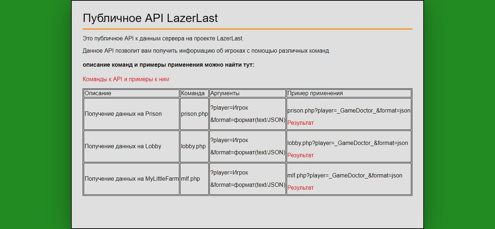

# Описание веб модуля для Launcher Minecraft ["LazerLast"](https://vk.com/lazerlast)

**LazerLast** - это игровой проект созданый в рамках игры "Minecraft", а именно - сервер, на котором были реализованы в период с 2019-2021 гг. различные игровые режимы (Prison, SkyBlock и др.).

---

Это просто документация в формате HTML к открытому API проекта "lazerLast".

---

# Description of web module for Launcher Minecraft ["LazerLast"](https://vk.com/lazerlast)

**LazerLast** - this game project, created in within computer game "Minecraft" (game server). On him was realized in 2019-2021 years different game modes (Prison, SkyBlock and other).

---

This is just documentation in format HTML to public API project "LazerLast".

---

*screenshot/Скриншот*
